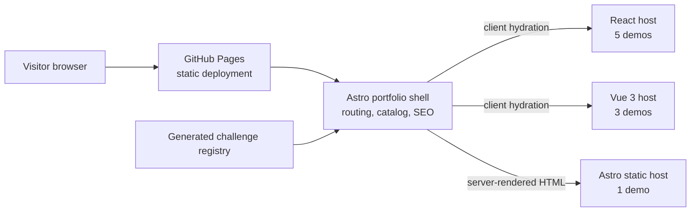
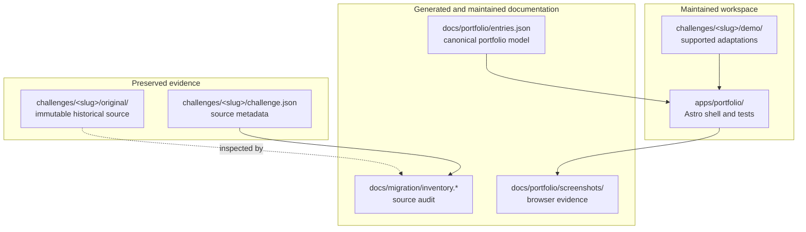
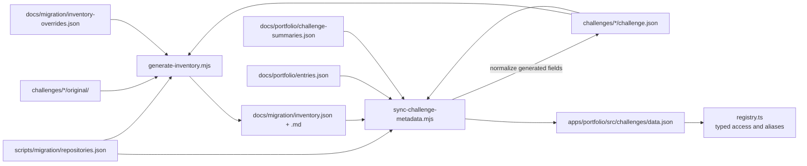
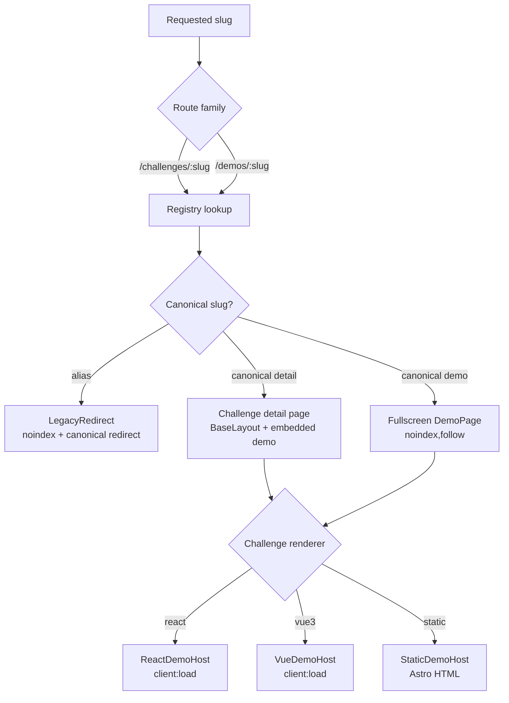
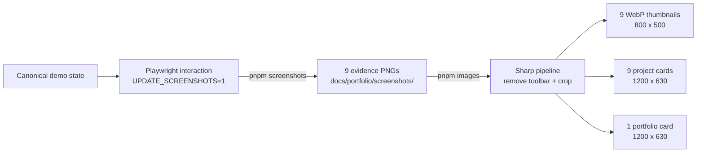
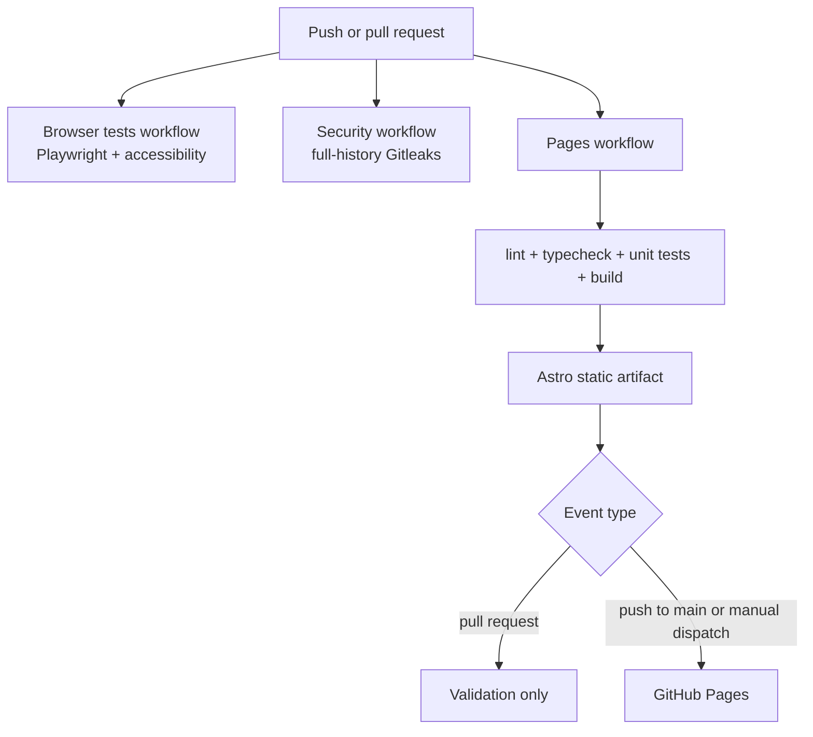

# Challenge Portfolio architecture

This document explains how preserved challenge sources become maintained,
deployable portfolio pages. It is intended for repository maintainers; the
public project narrative remains in the root README and individual challenge
READMEs.

## System context

The deployed application is a static Astro site hosted below the
`/challenge-portfolio/` GitHub Pages base path. Astro owns routing, shared
layout, metadata, and static generation. Interactive demos are isolated behind
small renderer hosts and hydrate only where a project demo is rendered.

The renderer counts describe the nine canonical entries. Historical projects
may use older or different stacks, but their dependencies are not part of the
deployed runtime.

## Repository boundaries

The critical ownership rule is one-way: maintained code may inspect and cite
`original/`, but must never modify it. Runtime fixes belong in `demo/`; catalog
and presentation fixes belong in `apps/portfolio/`.

## Metadata and catalog generation

`pnpm inventory` runs the inventory generator and metadata synchronizer in
sequence. The resulting registry is imported as typed data by Astro and is the
common input for pages, redirects, filters, structured data, and the sitemap.

Edit `entries.json` for canonical entry composition, themes, descriptions,
aliases, screenshots, or featured order. Edit a challenge manifest for facts
about a preserved source. Regenerate after either change and review every
generated diff.

## Request and renderer flow

Canonical project pages and fullscreen demos share the same registry entry and
demo implementation. Aliases never create a second canonical project.

`ChallengeDemo.astro` is the dispatch boundary. Additions must keep the
registry renderer and the corresponding React, Vue, or static host map in
sync.

## Image pipeline

Evidence screenshots are retained as source artifacts. `pnpm images` removes
the portfolio demo toolbar in memory, then creates deterministic web assets;
it does not rewrite the evidence PNGs.

Use `pnpm screenshots` only after a deliberate demo change. Use `pnpm images`
when the source screenshots are still valid and only their derived assets need
refreshing. Visually review generated binaries before publication.

## Validation and deployment

Pull requests run validation but never publish. A push to `main` runs the same
build path and, after a successful build, deploys the static artifact to
GitHub Pages.

The production build emits canonical pages, compatibility redirects,
fullscreen demos, `robots.txt`, and a sitemap restricted to the 12 canonical
URLs. After deployment, smoke-test both HTML-only pages and hydrated React and
Vue demos under the configured base path.

## Change-impact guide

| Change                               | Primary files                                | Required follow-up                                                                          |
| ------------------------------------ | -------------------------------------------- | ------------------------------------------------------------------------------------------- |
| Add or regroup a portfolio entry     | `docs/portfolio/entries.json`, demo package  | Run `pnpm inventory`; update the renderer host when needed; test canonical and alias routes |
| Change preserved-source metadata     | `challenges/<slug>/challenge.json`           | Run `pnpm inventory`; review inventory and registry diffs                                   |
| Change a maintained demo             | `challenges/<slug>/demo/`                    | Run unit and browser tests; refresh screenshots only when the reviewed UI changed           |
| Change cards or shared presentation  | `apps/portfolio/src/`                        | Run browser presentation and accessibility tests; review desktop and mobile layouts         |
| Change screenshots or social framing | screenshot evidence or `generate-images.mjs` | Run `pnpm images`; verify all dimensions and visually review the binary outputs             |
| Change routing, aliases, or SEO      | pages, layouts, registry, Astro config       | Test canonical metadata, redirects, `noindex`, robots, and the 12-URL sitemap               |
| Change deployment or dependencies    | workflow, package, or lock files             | Run the complete quality gate and verify GitHub Pages after publication                     |

The maintenance commands and release checklist remain canonical in the
[handbook](README.md).
